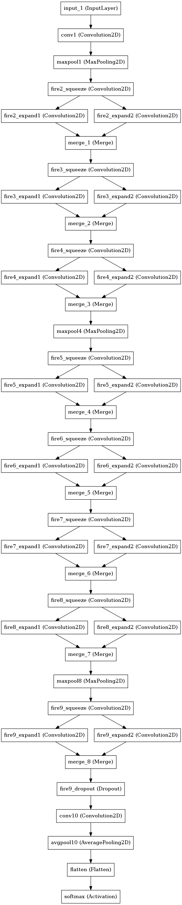

# SqueezeNet Keras Implementation
This is the Keras implementation of SqueezeNet using functional API (arXiv [1602.07360](https://arxiv.org/pdf/1602.07360.pdf)).
SqueezeNet is a small model of AlexNet-level accuracy with 50x fewer parameters and <0.5MB model size.
The original model was implemented in [caffe](https://github.com/DeepScale/SqueezeNet).

## Reference
[pysqueezenet by yhenon](https://github.com/yhenon/pysqueezenet)

Differences:
* Switch from Graph model to Keras 1.0 functional API
* Fix the bug of pooling layer 
* Many thanks to [StefOe](https://github.com/StefOe), the source can now support Keras 2.0 API.

## Result
This repository contains only the Keras implementation of the model, for other parameters used, please see the demo script, [squeezenet_demo.py](https://github.com/tammyyang/simdat/blob/devel/examples/keras/squeezenet_demo.py) in the simdat package.

The training process uses total 2,600 images with 1,300 per class (so, total two classes only).
There are total 130 images used for validation. After 20 epochs, the model achieves the following:
```
loss: 0.6563 - acc: 0.7065 - val_loss: 0.6247 - val_acc: 0.8750
```

## Model Visualization

